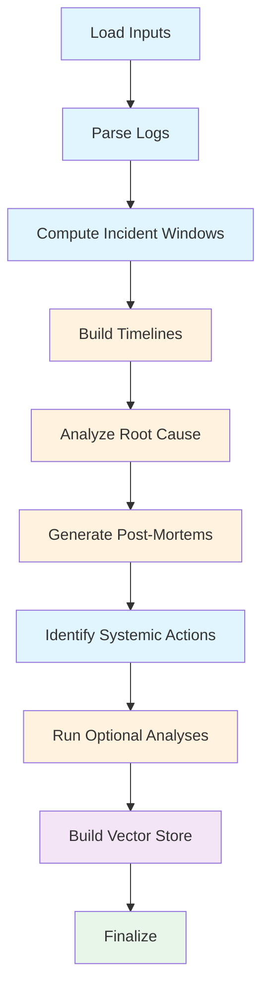
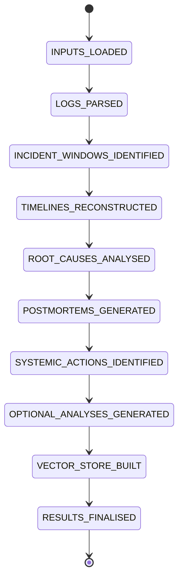

# AI-Powered Incident Analysis Pipeline

An automated incident analysis pipeline built with **LangChain** and **LangGraph** that parses production logs, reconstructs timelines, identifies root causes, generates post-mortem reports, and indexes failure taxonomies for semantic search. Exposed via a **FastAPI** REST API for production use.

## Pipeline Flow



| Color  | Meaning                |
| ------ | ---------------------- |
| Blue   | Deterministic (no LLM) |
| Orange | LLM-powered            |
| Purple | Vector store           |
| Green  | Finalization           |

## Setup

```bash
# Install dependencies (requires uv)
uv sync

# Configure environment
cp .env.example .env
# Fill in: ANTHROPIC_API_KEY, OPENAI_API_KEY, LANGSMITH_API_KEY, PINECONE_API_KEY
```

## Usage

### CLI

```bash
# Run the full pipeline
uv run main.py

# Validate all outputs
uv run validate.py

# Test semantic search over failure taxonomy
uv run pipeline/vector_store.py
```

### API server

```bash
# Start the FastAPI server (hot-reload enabled)
uv run api_main.py
# or
uv run run-api
```

API available at `http://localhost:8000`. Interactive docs at `http://localhost:8000/docs`.

### Docker

```bash
# Build image
docker build -t incident-analysis-pipeline .

# Run pipeline (one-shot)
docker run --rm --env-file .env incident-analysis-pipeline

# Run API server
docker run --rm -p 8000:8000 -e RUN_MODE=api --env-file .env \
  incident-analysis-pipeline python api_main.py

# Validate outputs
docker run --rm --env-file .env incident-analysis-pipeline python validate.py
```

## REST API

### Endpoints

| Method | Path                             | Description                                          |
| ------ | -------------------------------- | ---------------------------------------------------- |
| `GET`  | `/api/health`                    | Liveness check                                       |
| `POST` | `/api/pipeline/run`              | Trigger pipeline run → returns `job_id` (async, 202) |
| `GET`  | `/api/pipeline/{job_id}/status`  | Poll run status, stage, elapsed time                 |
| `GET`  | `/api/pipeline/{job_id}/results` | Fetch results and artifact paths when done           |
| `POST` | `/api/search`                    | Semantic search over Pinecone failure taxonomy       |
| `GET`  | `/api/artifacts`                 | List all output artifacts and existence status       |
| `GET`  | `/api/artifacts/{name}`          | Serve a named artifact (JSON/Markdown/JSONL)         |

### Job lifecycle

```
POST /api/pipeline/run  →  { "job_id": "...", "status": "PENDING" }
GET  /api/pipeline/{id}/status  →  RUNNING (current_stage updates live)
GET  /api/pipeline/{id}/results  →  COMPLETED + artifact map
```

### Example

```bash
# Trigger a run
curl -X POST http://localhost:8000/api/pipeline/run \
  -H "Content-Type: application/json" -d "{}"
# → {"job_id":"abc-123","status":"PENDING","created_at":"..."}

# Poll status
curl http://localhost:8000/api/pipeline/abc-123/status
# → {"status":"RUNNING","current_stage":"TIMELINES_RECONSTRUCTED","elapsed_seconds":45.2,...}

# Fetch results when done
curl http://localhost:8000/api/pipeline/abc-123/results

# Semantic search
curl -X POST http://localhost:8000/api/search \
  -H "Content-Type: application/json" \
  -d '{"query": "connection pool exhaustion prevention", "top_k": 5}'

# List artifacts
curl http://localhost:8000/api/artifacts

# Get a specific artifact
curl http://localhost:8000/api/artifacts/postmortem_a
curl http://localhost:8000/api/artifacts/timelines
```

### Available artifact names

| Name                  | File                          |
| --------------------- | ----------------------------- |
| `incident_metrics`    | `incident_metrics.json`       |
| `timelines`           | `timelines.json`              |
| `root_cause_analysis` | `root_cause_analysis.json`    |
| `postmortem_a`        | `postmortem_a.md`             |
| `postmortem_b`        | `postmortem_b.md`             |
| `systemic_actions`    | `systemic_actions.md`         |
| `mttr_analysis`       | `mttr_analysis.md`            |
| `communications`      | `communications.md`           |
| `failure_taxonomy`    | `failure_mode_taxonomy.json`  |
| `predictive_signals`  | `predictive_signals.json`     |
| `llm_calls`           | `llm_calls.jsonl`             |
| `parsed_logs_a`       | `parsed_logs/incident_a.json` |
| `parsed_logs_b`       | `parsed_logs/incident_b.json` |

## Architecture

### LangGraph StateGraph

The pipeline is a strict sequential `StateGraph` where each node reads from shared state, writes artifacts to disk, and updates state for the next node.



### LLM Call Budget

| Stage                   | Calls | Model             |
| ----------------------- | ----- | ----------------- |
| Timeline Reconstruction | 2     | Claude Sonnet 4.5 |
| Root Cause Analysis     | 1     | Claude Sonnet 4.5 |
| Post-Mortem Generation  | 2     | Claude Sonnet 4.5 |
| MTTR Analysis           | 1     | Claude Sonnet 4.5 |
| Communication Drafts    | 1     | Claude Sonnet 4.5 |
| Failure Mode Taxonomy   | 1     | Claude Sonnet 4.5 |
| Predictive Signals      | 1     | Claude Sonnet 4.5 |
| **Total**               | **9** |                   |

### Fallback Chain


### Caching Strategy

| Layer          | What's Cached                      | Storage                           |
| -------------- | ---------------------------------- | --------------------------------- |
| LLM responses  | All LLM calls (exact prompt match) | SQLite (`.llm_cache.db`)          |
| Vector queries | Pinecone search results            | JSON (`.vector_query_cache.json`) |
| Vector store   | Skips rebuild if index has data    | Pinecone (remote)                 |

Replays with unchanged inputs complete in **<1 second** (no API calls).

## Project Structure

```
deriv-tech-interview/
├── main.py                     # Pipeline CLI entry point
├── api_main.py                 # API server entry point
├── config.py                   # All configuration & constants
├── validate.py                 # Output validation script
├── api/
│   ├── app.py                  # FastAPI factory, lifespan
│   ├── job_store.py            # In-memory job registry (swap for Redis in prod)
│   ├── schemas.py              # API request/response Pydantic models
│   └── routes/
│       ├── pipeline.py         # POST /run, GET /{id}/status, GET /{id}/results
│       ├── search.py           # POST /search (Pinecone semantic search)
│       └── artifacts.py        # GET /artifacts, GET /artifacts/{name}
├── pipeline/
│   ├── state.py                # LangGraph PipelineState TypedDict
│   ├── graph.py                # StateGraph construction
│   ├── llm_client.py           # LLM init, fallbacks, caching, logging
│   ├── log_parser.py           # Deterministic log parsing
│   ├── incident_windows.py     # MTTR & window calculation
│   ├── timeline_builder.py     # LLM: timeline reconstruction
│   ├── root_cause_analyzer.py  # LLM: root cause analysis
│   ├── postmortem_generator.py # LLM: post-mortem reports
│   ├── systemic_actions.py     # Cross-incident action analysis
│   ├── optional_analyses.py    # LLM: MTTR, comms, taxonomy, signals
│   └── vector_store.py         # Pinecone vector store (LangChain)
├── prompts/                    # LLM prompt strings (separated from pipeline logic)
│   ├── timeline_reconstruction.py  # Stage 1: timeline reconstruction prompts
│   ├── root_cause_analysis.py      # Stage 2: root cause analysis prompts
│   ├── postmortem_generation.py    # Stage 3: post-mortem generation prompts
│   ├── mttr_analysis.py            # Optional: MTTR trend analysis prompts
│   ├── communication_drafts.py     # Optional: stakeholder comms prompts
│   ├── failure_taxonomy.py         # Optional: failure mode taxonomy prompts
│   └── predictive_signals.py       # Optional: predictive signal prompts
├── models/
│   ├── log_entry.py            # ParsedLogEntry, ParsedFields
│   ├── incident.py             # IncidentWindow, IncidentMetrics
│   ├── timeline.py             # TimelineEntry, IncidentTimeline
│   ├── root_cause.py           # RootCauseResult, CrossIncidentAnalysis
│   ├── postmortem.py           # ActionItem, PostMortemSections
│   └── llm_call.py             # LLMCallRecord
├── incident_a.log              # Input: Incident A
├── incident_b.log              # Input: Incident B
└── historical_incidents.json   # Input: Historical incident DB
```

## Output Artifacts

| File                         | Description                            |
| ---------------------------- | -------------------------------------- |
| `parsed_logs/*.json`         | Structured parsed log entries          |
| `incident_metrics.json`      | Incident windows and MTTR calculations |
| `timelines.json`             | Reconstructed incident timelines       |
| `root_cause_analysis.json`   | Cross-incident root cause analysis     |
| `postmortem_a.md`            | Post-mortem report for Incident A      |
| `postmortem_b.md`            | Post-mortem report for Incident B      |
| `systemic_actions.md`        | Cross-incident systemic actions        |
| `llm_calls.jsonl`            | LLM call audit log                     |
| `mttr_analysis.md`           | MTTR trend analysis                    |
| `communications.md`          | Stakeholder communication drafts       |
| `failure_mode_taxonomy.json` | Failure mode taxonomy                  |
| `predictive_signals.json`    | Predictive signals for early detection |

## Observability

- **LangSmith**: Full tracing enabled (set `LANGSMITH_TRACING=true`)
- **LLM Call Log**: Every call recorded in `llm_calls.jsonl` with stage, model, duration, success/failure
- **Python logging**: Structured logging throughout with timestamps and module names

## Semantic Search (Vector Store)

The failure mode taxonomy is automatically indexed into Pinecone for future semantic retrieval:

```python
from pipeline.vector_store import search_taxonomy

results = search_taxonomy("connection pool exhaustion prevention")
for doc in results:
    print(doc.page_content)
```
